# pfSense Firewall Home Lab
**Blocking Real SYN Flood Attacks with Custom Firewall Rules**

Hands-on lab demonstrating simulation and blocking of SYN flood attacks using pfSense custom firewall rules.

---

## Overview

I built this lab to gain real hands-on experience with configuring and defending a production-grade firewall — the kind of work SOC analysts and network security engineers do every day.

I installed pfSense from scratch on my ASUS Windows laptop using VirtualBox and created a realistic dual-network environment. I then launched a SYN flood attack from Kali Linux, watched it overwhelm the firewall, and finally blocked it with custom rules.

---

## Lab Setup

| Component | Details |
|---|---|
| Host Machine | ASUS Windows laptop + VirtualBox |
| Firewall | pfSense 2.8.1 |
| Attacker VM | Kali Linux (WAN side) – IP 10.0.2.15 |
| Management VM | Ubuntu (LAN side) – IP 192.168.1.11 |
| pfSense WAN Gateway | 10.0.2.3 |
| pfSense LAN Gateway | 192.168.1.1 |
| Networking | Bridged adapter on both VMs |

---

## Table of Contents
- [Initial Setup](#initial-setup)
- [Network Configuration](#network-configuration)
- [Custom Firewall Rules](#custom-firewall-rules)
- [Attack Simulation](#attack-simulation)
- [Blocking the Attack](#blocking-the-attack)
- [Challenges & Troubleshooting](#challenges--troubleshooting)

---

## Initial Setup

I downloaded the pfSense ISO and created a new VM in VirtualBox. After booting, I completed the text-based console setup wizard (hostname, domain, WAN interface) and reset the default admin password.


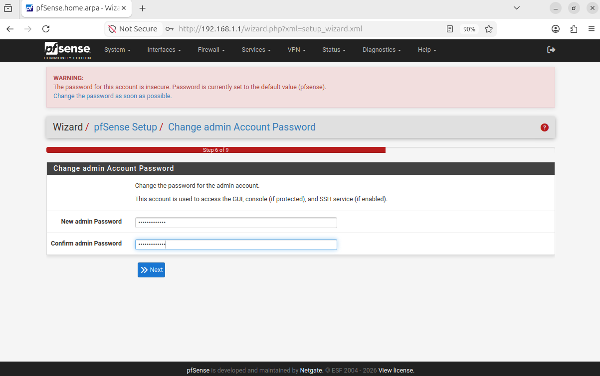

---

## Network Configuration

I configured the WAN interface and enabled the DHCP server on the LAN side so the Ubuntu machine could get an IP automatically.

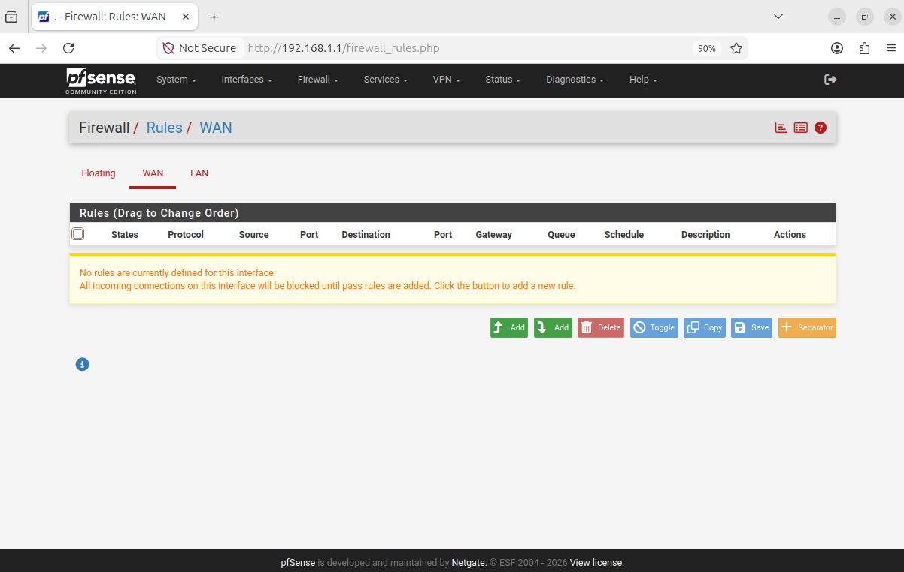

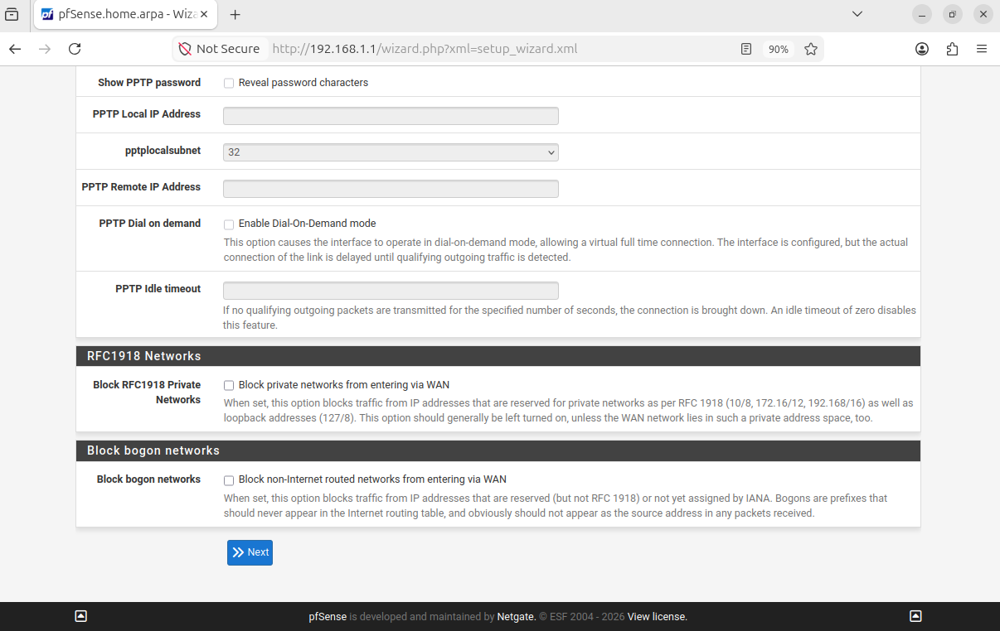

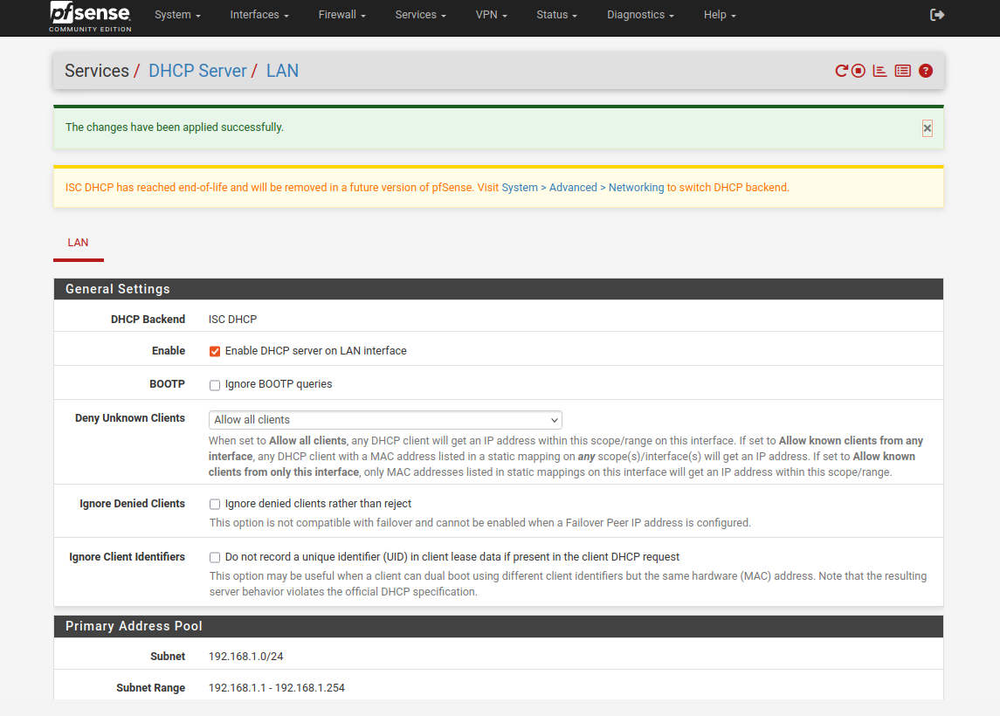

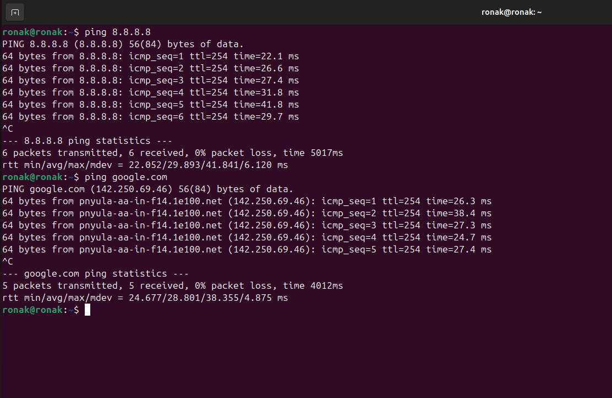

---

## Custom Firewall Rules

I created two rules on the WAN interface: one to block the Kali attacker IP and another to catch SYN flood attempts. I enabled logging on both.

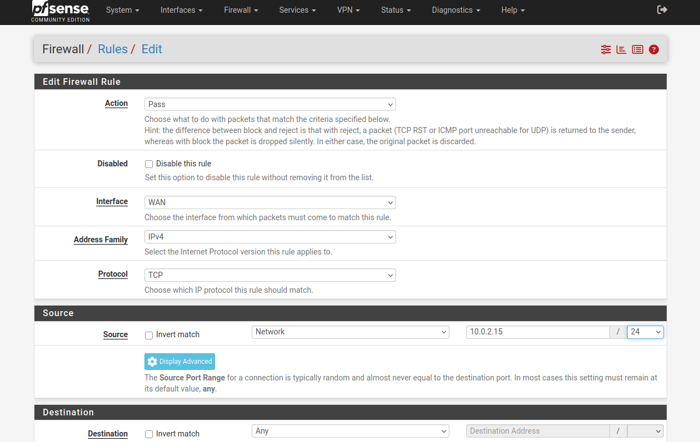

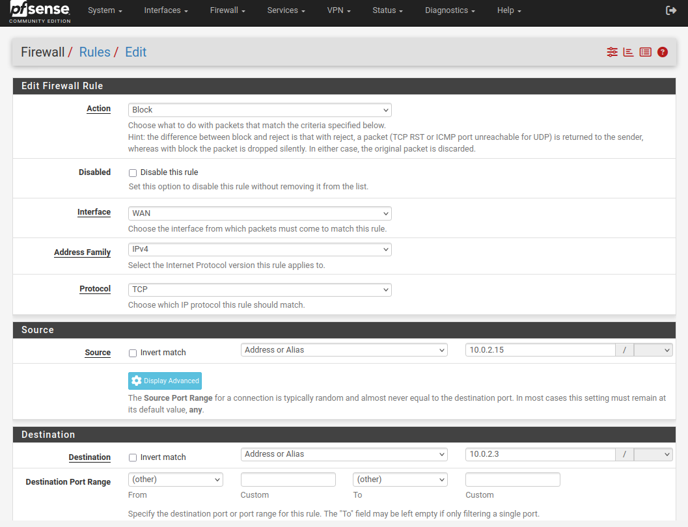

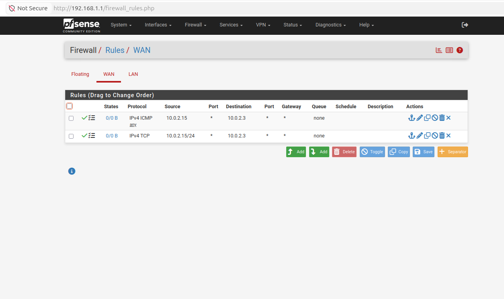

---

## Attack Simulation

From Kali Linux I ran:

```bash
hping3 -S -p 80 --flood --rand-source 10.0.2.3
```

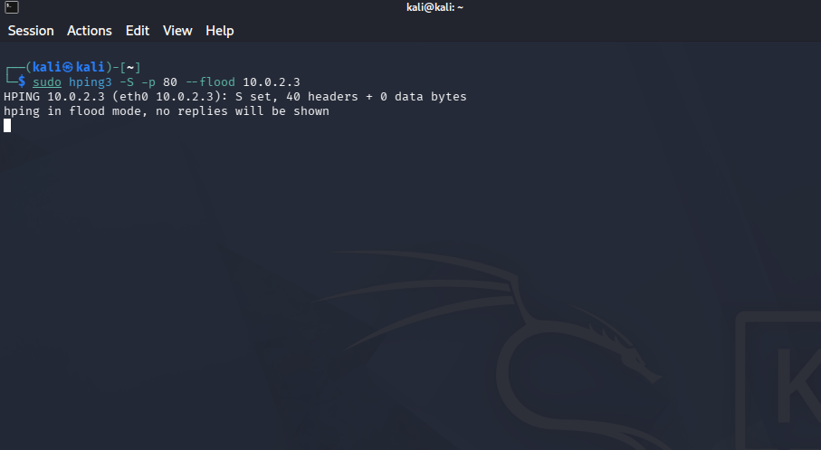

Wireshark showing the flood in progress (before rules — ~30,000 packets/sec):

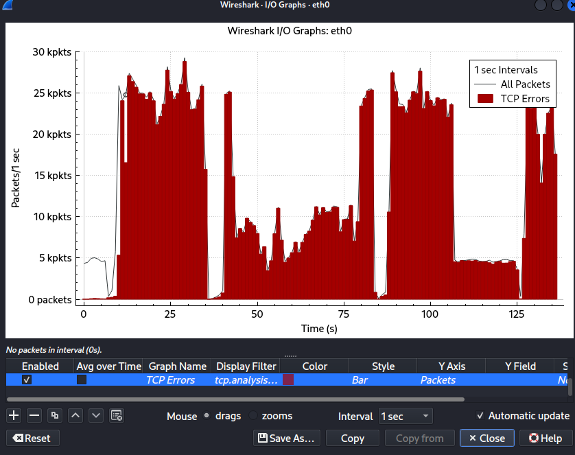

---

## Blocking the Attack

After applying the rules, I ran the same attack again. pfSense immediately blocked the packets. The web interface stayed responsive, logs showed dropped traffic, and ping from Kali failed.

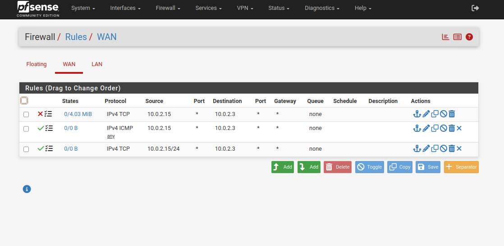

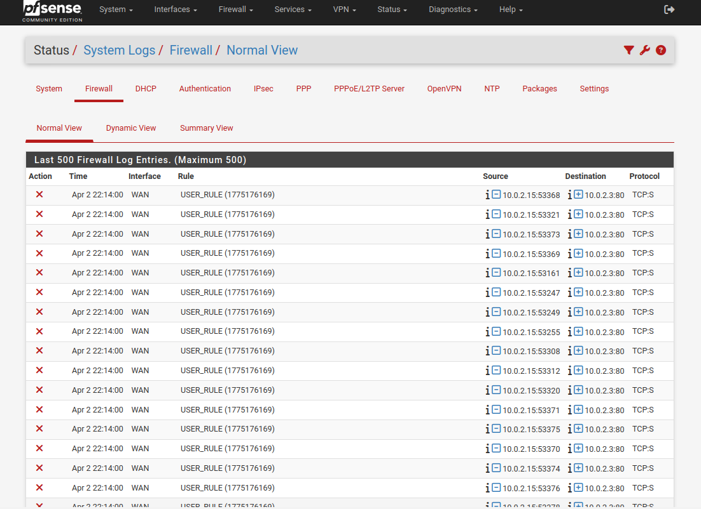

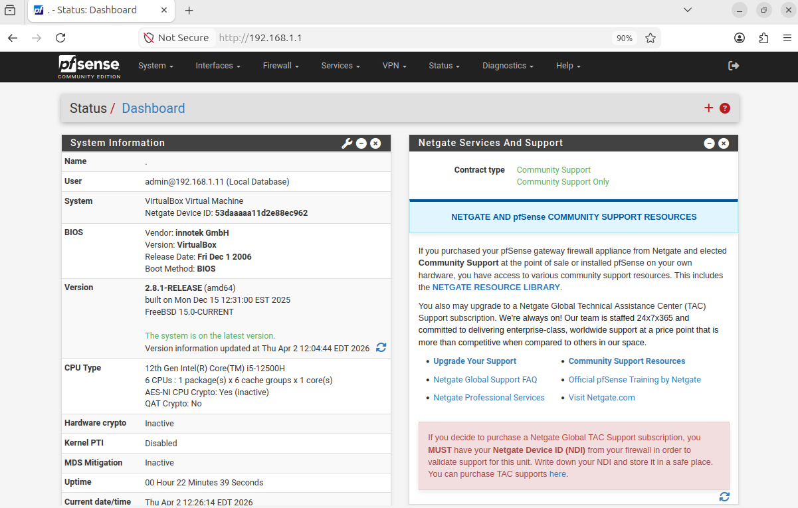

---

## Challenges & Troubleshooting

- Console-only initial setup with no GUI fallback
- Resetting the default admin password multiple times
- Unlocking WAN access for the private network
- Fixing Ubuntu network connectivity after the flood using `nmcli` and `ip link`

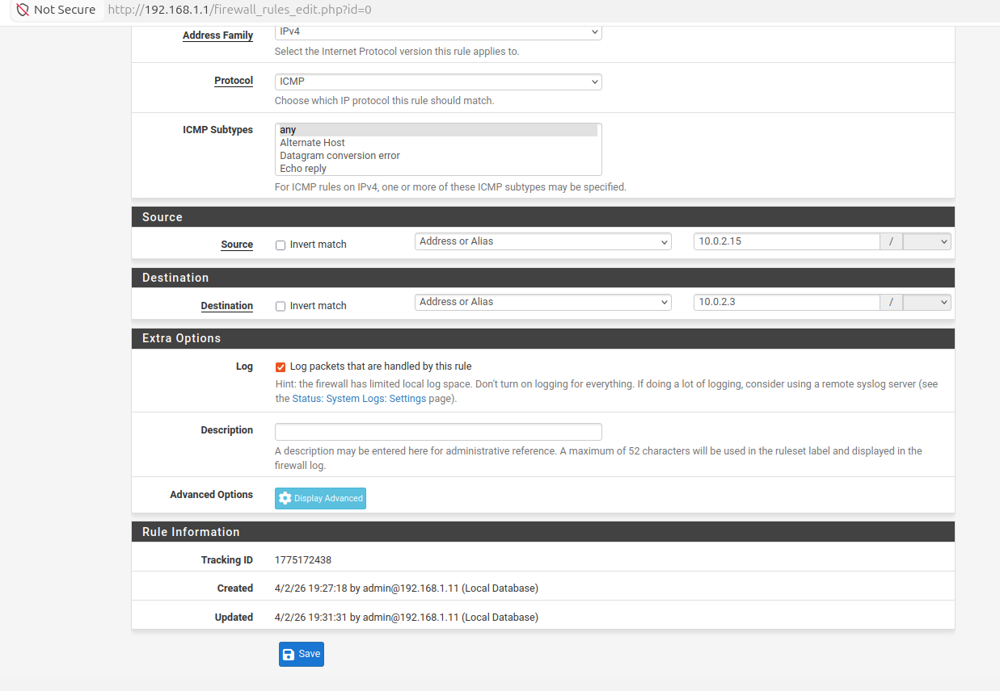

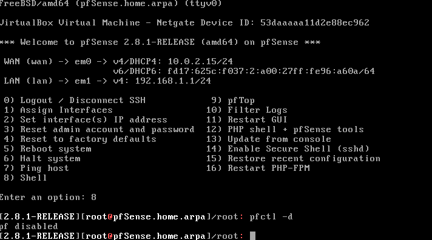

---

## Key Takeaways

- How to install and configure pfSense from console to GUI
- The real packet-level impact of SYN flood attacks
- Why rule order, logging, and testing matter in production firewalls
- How to troubleshoot network issues under active attack conditions

---

## SOC Relevance

This lab gave me direct experience with perimeter defense, rule creation, DoS mitigation, and log analysis — core skills used daily in SOC environments.

---

## Full Project Report

[Download Detailed PDF Report](pfSense-Firewall-Home-Lab-Project.pdf)

---

## Next Steps

- Forward pfSense logs to Splunk for correlation searches
- Expand with additional attack scenarios (UDP flood, ICMP flood, port scanning)

---

## Author

**Ronak** — [GitHub](https://github.com/ronakmishra28) | [Portfolio](https://ronakmishra28.github.io)
